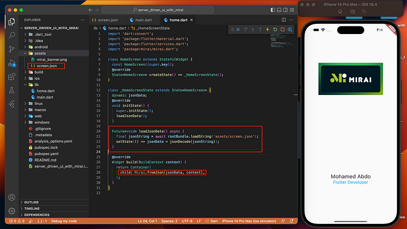
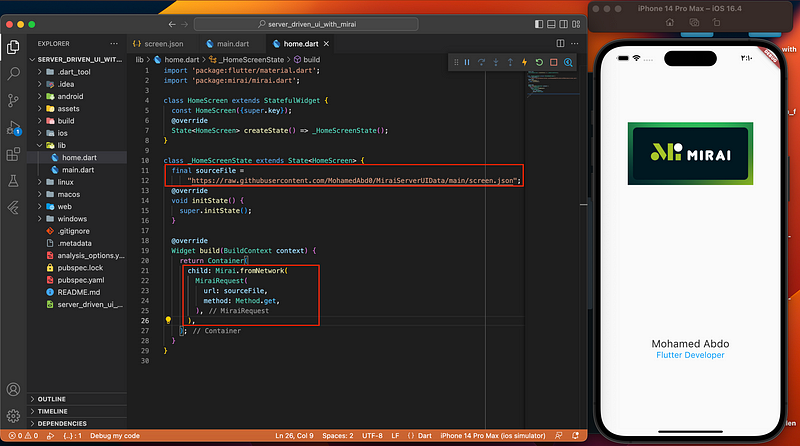
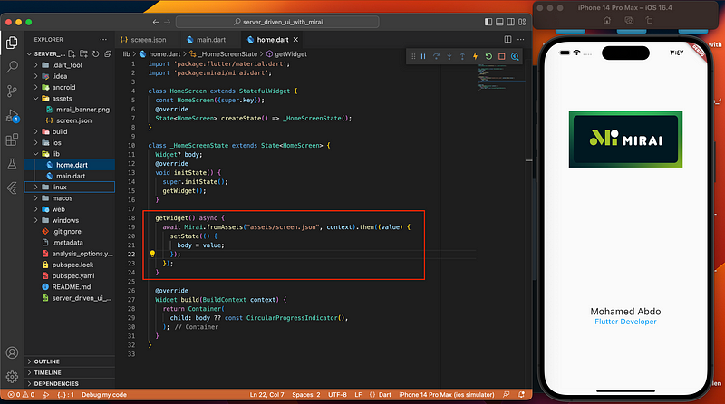

# server_driven_ui_with_mirai

Creating Dynamic and Scalable UI with Server-Driven UI in Flutter with Mirai

## Getting Started

# Mirai.fromAsset()

This method allows you to load a JSON configuration from a local asset file in your Flutter app. You can specify the asset path of the JSON configuration as a string to this method, and Mirai will load and parse the JSON, and generate the corresponding Flutter widgets. For example:

# Mirai.fromNetwork()

This method allows you to fetch the JSON configuration from a remote network source, such as an API endpoint. You can pass the URL of the JSON configuration as a string to this method, and Mirai will fetch and parse the JSON, and generate the corresponding Flutter widgets. For example:

# Mirai.fromJson()

This method allows you to parse a JSON configuration directly from a string in your Flutter app. You can pass the JSON configuration as a string to this method, along with the BuildContext context and Mirai will parse the JSON and generate the Flutter widgets. For example:

